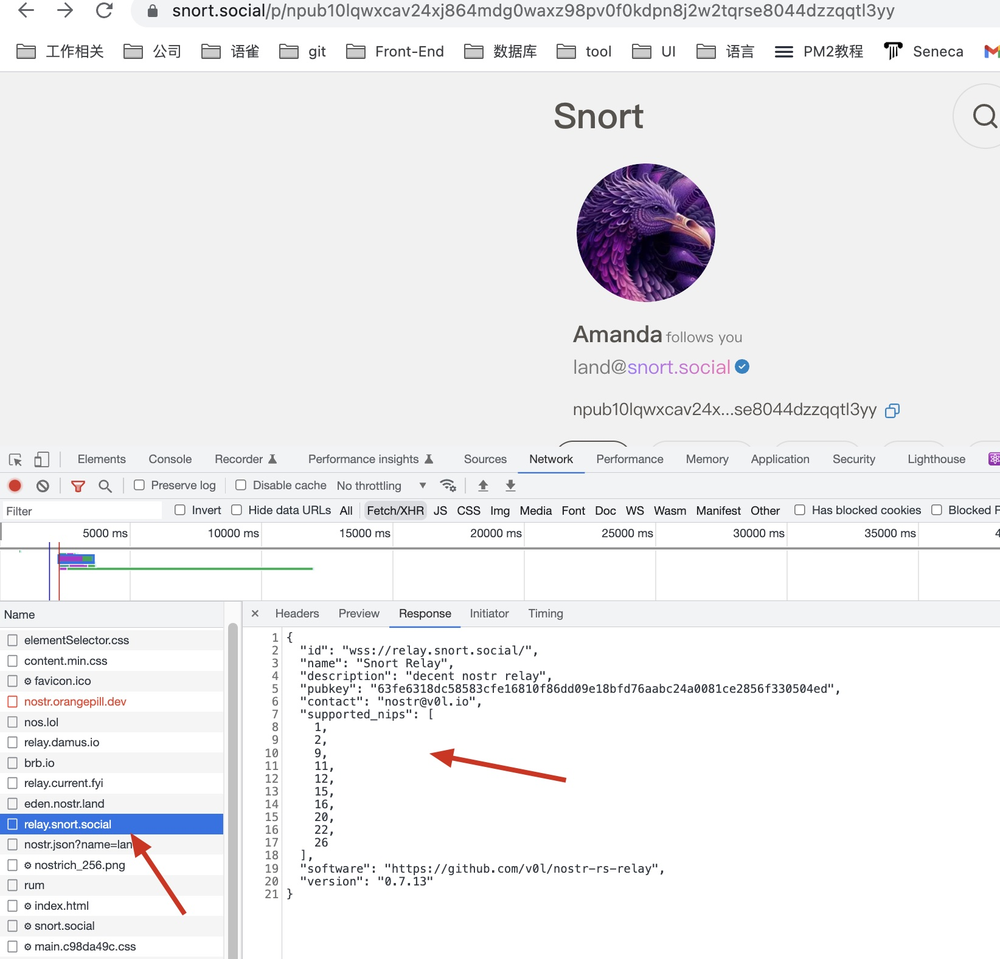

## Relays 是什么

Relays 对 客户端提供服务, 可以对事件进行处理。

## Relays 查询 网站

1. https://nostr.watch/relays/find
2. https://nostr-registry.netlify.app/

## Relays 返回信息

```json
{
  "name": <string identifying relay>,
  "description": <string with detailed information>,
  "pubkey": <administrative contact pubkey>,
  "contact": <administrative alternate contact>,
  "supported_nips": <a list of NIP numbers supported by the relay>,
  "software": <string identifying relay software URL>,
  "version": <string version identifier>
}
```

客户端可以通过 `supported_nips` 了解 Relays 支持的功能


